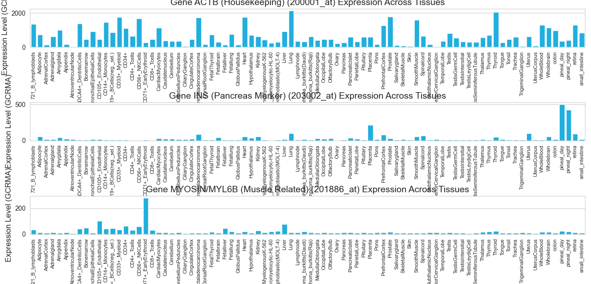

# Human Tissue Gene Expression Analysis 人類組織基因表達譜分析 (BioGPS GNF1H)

## 🎯 Project 01: 專案概述 (Project Overview)

本專案利用 Python 進行高維基因表達數據的探索性分析 (EDA) 和機器學習降維，以識別人類組織在基因層面的內在相似性和功能特徵。

* **數據來源:** BioGPS Human U133A / GNF1H Gene Atlas（包含 84 種組織和細胞類型）。
* **核心技術:** Pandas 數據處理, Matplotlib/Seaborn 視覺化, Scikit-learn 主成分分析 (PCA)。

## 📊 分析成果 (Analysis Results)

### 1. 特定功能基因表達驗證 (Functional Gene Validation)

通過觀察三個具有代表性的基因，驗證數據質量和生物學特異性。

- **ACTB (200001_at):** 穩定的看家基因，在所有組織中普遍表達。
- **INS (203002_at):** 胰島素基因，表達量高度特異性地集中在胰腺組織。
- **MYH11/肌動蛋白相關 (201886_at):** 在平滑肌組織中表達較高。



---

### 2. 組織功能聚類與降維 (Tissue Clustering via PCA)

使用所有 44,775 個基因的表達值，通過主成分分析 (PCA) 將高維數據降至二維，展示組織之間的整體基因表達相似性。

**關鍵發現:**

* **神經組織聚類:** 所有大腦相關區域（如小腦、杏仁核、下丘腦）在 PC1/PC2 空間中形成一個緊密的群組。
* **血液細胞分離:** 淋巴細胞、單核細胞等血液相關細胞被清晰地分離出來。


## ⚙️ 運行環境與要求 (Setup and Requirements)

本專案使用 Python 3.x 運行，請確保您的環境安裝了以下函式庫：

```bash
pip install pandas matplotlib seaborn scikit-learn
